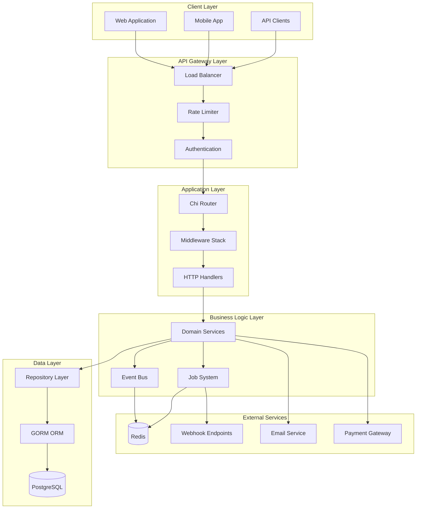
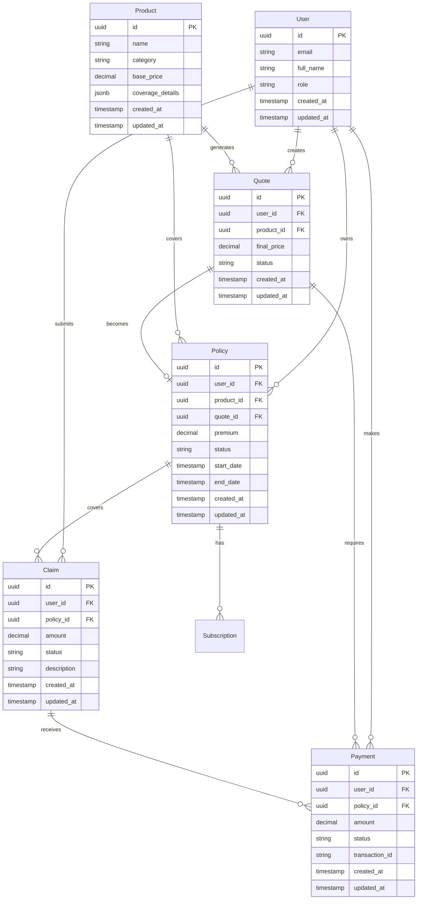
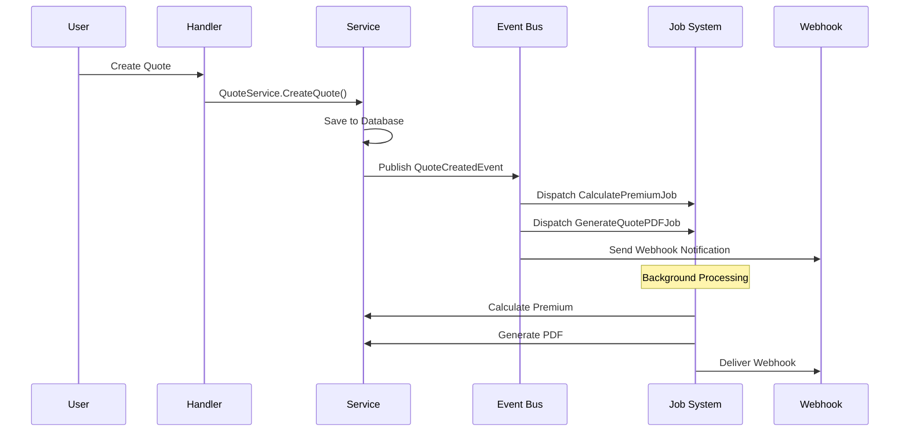
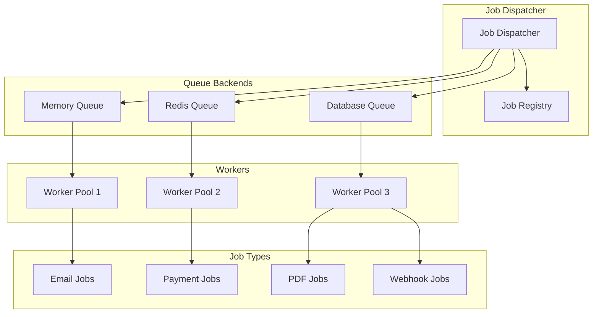
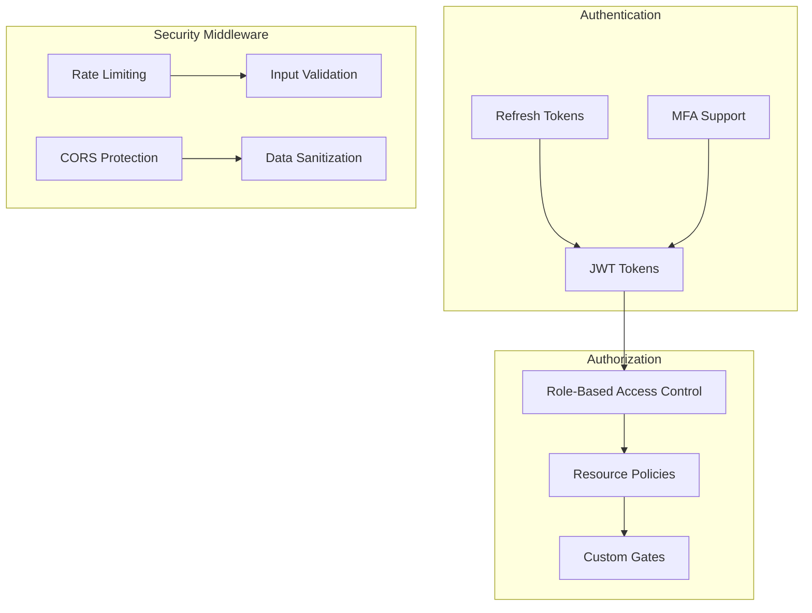
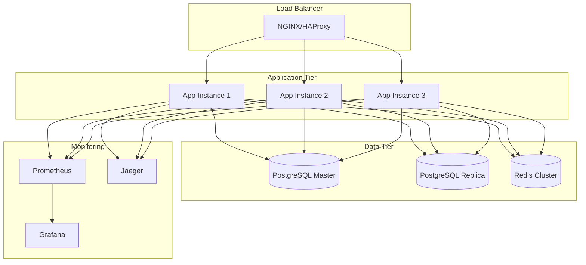

# Architecture Overview

## System Architecture

The Bazaruto Insurance Platform follows a layered architecture pattern with clear separation of concerns, inspired by Domain-Driven Design (DDD) principles and Rails/Laravel conventions.

## High-Level Architecture

## Layer Details

### 1. Client Layer
- **Web Application**: React/Vue.js frontend
- **Mobile App**: iOS/Android applications
- **API Clients**: Third-party integrations

### 2. API Gateway Layer
- **Load Balancer**: Distributes traffic across multiple instances
- **Rate Limiter**: Token bucket algorithm with Redis backend
- **Authentication**: JWT token validation and refresh

### 3. Application Layer
- **Chi Router**: High-performance HTTP router
- **Middleware Stack**: 
  - Recovery middleware
  - Logging middleware
  - Authentication middleware
  - Authorization middleware
  - Rate limiting middleware
  - Metrics middleware
  - Tracing middleware
- **HTTP Handlers**: Request/response handling with JSON helpers

### 4. Business Logic Layer
- **Domain Services**: Core business logic
  - UserService
  - ProductService
  - QuoteService
  - PolicyService
  - ClaimService
  - PaymentService
  - WebhookService
- **Event Bus**: Domain event publishing and subscription
- **Job System**: Background job processing with multiple queues

### 5. Data Layer
- **Repository Layer**: Data access abstraction
- **GORM ORM**: Object-relational mapping
- **PostgreSQL**: Primary database with UUID primary keys

### 6. External Services
- **Redis**: Caching, sessions, and job queues
- **Email Service**: SMTP/SendGrid integration
- **Payment Gateway**: Stripe/PayPal integration
- **Webhook Endpoints**: External system notifications

## Domain Model

## Event-Driven Architecture

The platform uses an event-driven architecture for loose coupling and scalability:

## Job System Architecture

The job system supports multiple backends and provides reliable processing:

## Security Architecture

## Deployment Architecture

## Key Design Principles

### 1. Separation of Concerns
- Each layer has a specific responsibility
- Clear boundaries between layers
- Dependency injection for testability

### 2. Domain-Driven Design
- Business logic encapsulated in services
- Rich domain models
- Event-driven communication

### 3. SOLID Principles
- Single Responsibility Principle
- Open/Closed Principle
- Liskov Substitution Principle
- Interface Segregation Principle
- Dependency Inversion Principle

### 4. Clean Architecture
- Independent of frameworks
- Testable business logic
- Independent of UI
- Independent of database
- Independent of external services

### 5. Event-Driven Architecture
- Loose coupling between components
- Scalable and maintainable
- Asynchronous processing
- Event sourcing capabilities

## Technology Stack

### Backend
- **Language**: Go 1.22+
- **Framework**: Chi v5 (HTTP router)
- **ORM**: GORM v2
- **Database**: PostgreSQL 14+
- **Cache**: Redis 6+
- **Authentication**: JWT with refresh tokens
- **Logging**: Zap (structured logging)
- **Metrics**: Prometheus
- **Tracing**: OpenTelemetry + Jaeger

### Infrastructure
- **Containerization**: Docker
- **Orchestration**: Kubernetes
- **CI/CD**: GitHub Actions
- **Monitoring**: Prometheus + Grafana
- **Log Aggregation**: ELK Stack (optional)

### External Services
- **Email**: SMTP/SendGrid
- **Payments**: Stripe/PayPal
- **File Storage**: AWS S3 (optional)
- **CDN**: CloudFlare (optional)

## Scalability Considerations

### Horizontal Scaling
- Stateless application instances
- Load balancer distribution
- Database read replicas
- Redis clustering

### Performance Optimization
- Connection pooling
- Query optimization
- Caching strategies
- Background job processing

### Monitoring and Observability
- Application metrics
- Business metrics
- Distributed tracing
- Health checks
- Alerting

This architecture provides a solid foundation for building a scalable, maintainable, and secure insurance platform.