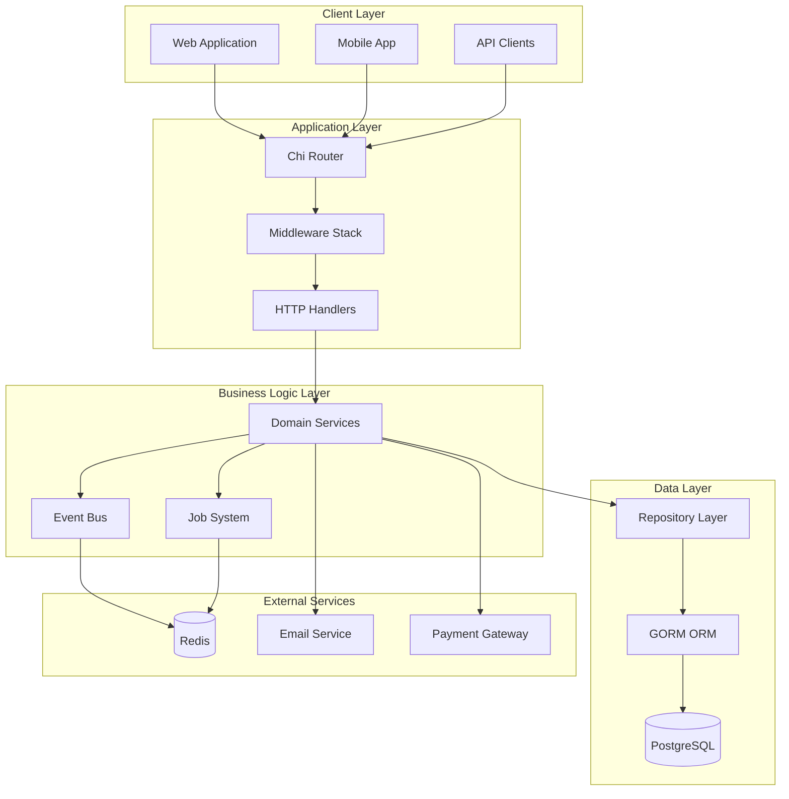

# Architecture Overview

The Bazaruto Insurance Platform follows a layered architecture pattern with clear separation of concerns, inspired by Domain-Driven Design (DDD) principles and Rails/Laravel conventions.

## High-Level Architecture



## Layer Responsibilities

### 1. HTTP Layer
- **Router**: Chi-based HTTP routing
- **Handlers**: HTTP request/response handling
- **Middleware**: Authentication, authorization, logging, rate limiting

### 2. Business Logic Layer
- **Services**: Core business logic and domain operations
- **Events**: Domain events and event-driven architecture
- **Jobs**: Background job processing

### 3. Data Layer
- **Store**: Repository pattern for data access
- **Models**: Domain entities and database models
- **GORM**: Object-relational mapping

## Key Design Patterns

### 1. Repository Pattern
```go
type UserStore interface {
    Create(ctx context.Context, user *models.User) error
    GetByID(ctx context.Context, id uuid.UUID) (*models.User, error)
    Update(ctx context.Context, user *models.User) error
    Delete(ctx context.Context, id uuid.UUID) error
}
```

### 2. Service Layer Pattern
```go
type UserService struct {
    userStore store.UserStore
    eventBus  event.EventBus
    logger    *logger.Logger
}

func (s *UserService) CreateUser(ctx context.Context, req *CreateUserRequest) (*models.User, error) {
    // Business logic here
    user := &models.User{...}
    
    if err := s.userStore.Create(ctx, user); err != nil {
        return nil, err
    }
    
    // Publish domain event
    s.eventBus.Publish(ctx, events.NewUserCreatedEvent(user))
    
    return user, nil
}
```

### 3. Event-Driven Architecture
```go
type EventHandler interface {
    Handle(ctx context.Context, event Event) error
    HandlerName() string
}

// Example: User registration triggers welcome email
func (h *EmailHandler) Handle(ctx context.Context, event events.Event) error {
    if userEvent, ok := event.(*events.UserCreatedEvent); ok {
        return h.sendWelcomeEmail(ctx, userEvent.User)
    }
    return nil
}
```

## Data Flow

### 1. Request Processing Flow
```
HTTP Request → Router → Middleware → Handler → Service → Store → Database
                     ↓
                Event Bus → Event Handlers → Background Jobs
```

### 2. Event Processing Flow
```
Domain Event → Event Bus → Event Handlers → Background Jobs → External Services
```

## Configuration Architecture

The platform uses a dual configuration system:

### 1. Application Configuration (Viper)
- Infrastructure settings (database, Redis, server)
- Environment-specific configuration
- Supports YAML, JSON, TOML, environment variables

### 2. Business Rules Configuration (File-based)
- Business logic configuration
- Independent of database
- JSON format with in-memory caching
- Hot reloading support

## Security Architecture

### 1. Authentication Flow
```
Client → JWT Token → Middleware → Handler → Service
```

### 2. Authorization Flow
```
Request → RBAC Check → Policy Check → Resource Access
```

### 3. Rate Limiting
```
Request → Rate Limiter → Token Bucket → Allow/Deny
```

## Job System Architecture

### 1. Job Processing Flow
```
Job Creation → Queue → Worker → Processing → Completion/Failure
```

### 2. Queue Management
- Multiple queue backends (Memory, Redis, Database)
- Priority-based job processing
- Retry mechanisms with exponential backoff
- Dead letter queue for failed jobs

## Monitoring and Observability

### 1. Logging
- Structured logging with Zap
- Request/response logging
- Correlation IDs for tracing

### 2. Metrics
- Prometheus metrics
- Custom business metrics
- HTTP and database metrics

### 3. Tracing
- OpenTelemetry integration
- Distributed tracing
- Custom spans for business logic

## Deployment Architecture

### 1. Container Architecture
```
Docker Container → Application → Dependencies (PostgreSQL, Redis)
```

### 2. Kubernetes Architecture
```
Ingress → Service → Deployment → Pods → Persistent Volumes
```

## Scalability Considerations

### 1. Horizontal Scaling
- Stateless application design
- External session storage (Redis)
- Load balancer distribution

### 2. Database Scaling
- Connection pooling
- Read replicas support
- Query optimization

### 3. Job Processing Scaling
- Multiple worker instances
- Queue partitioning
- Worker specialization

## Technology Stack

### Core Technologies
- **Language**: Go 1.22+
- **Web Framework**: Chi router
- **Database**: PostgreSQL 14+
- **Cache**: Redis 6+
- **ORM**: GORM

### Supporting Technologies
- **Authentication**: JWT
- **Logging**: Zap
- **Metrics**: Prometheus
- **Tracing**: OpenTelemetry
- **Containerization**: Docker
- **Orchestration**: Kubernetes

## Development Principles

### 1. Clean Architecture
- Separation of concerns
- Dependency inversion
- Testable design

### 2. Domain-Driven Design
- Business logic in services
- Domain events
- Repository pattern

### 3. SOLID Principles
- Single responsibility
- Open/closed principle
- Dependency inversion

### 4. Go Best Practices
- Interface-based design
- Error handling
- Context propagation
- Goroutine management